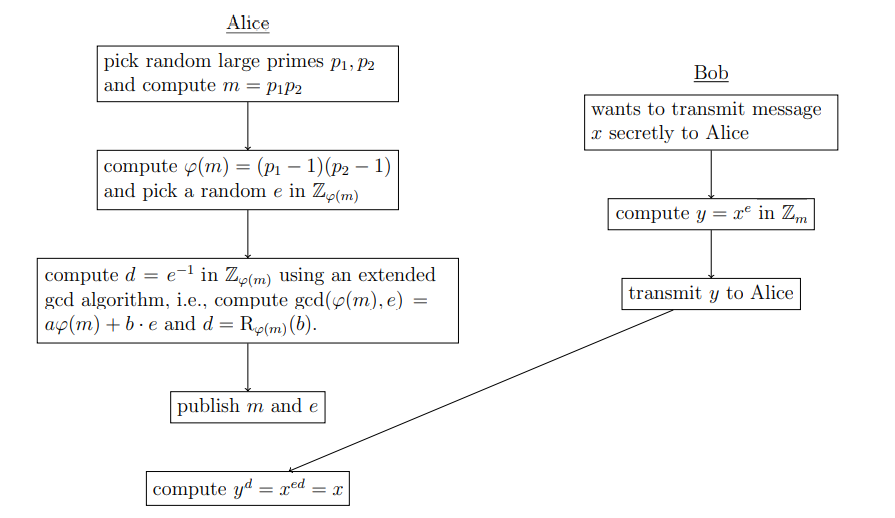

# Chaining Data Signatures
## Welcome!

Authenticity of data is a modern day issue. Who's deep-faked what and where did someone actually get an image is a real problem as disinformation is used like a tool.

Humans may end up not being able to tell the difference between a deep-fake and reality, and individuals may never know whether an image is authentic or not, unless the source is known and can be validated.

> ^ Did Tom Cruise really take the photo?

Until the quantum age computing can't beat maths. Encryption to validate the chain of sources sharing data could help to eliminate false facts.

(This diagram is for encrypting messages by RSA, though it is used dfferently here)\
[Cambridge University Engineering Department, 2020]

## This Code :o

This Python code demonstrates how to chain signatures. Run `user.py` to see how one can create, share and read text and images all while maintaining knowledge of whom the authentic data sources are.

> Sources:\
> 'BigFibber@liars.com' ===> Authentic\
> 'NotMrCruise@dubious.org' ===> Authentic\
> 'tomCruiseOfficial@gmail.com' ===> Not Authentic

It uses RSA encryption on a SHA256 hash of the data, where the private key encrypts and the public key decrypts.

## What Now?

- Do the same thing in C#
  - Frontend & backend camera app & RSA encrypt
  - Saving to local storage
  - Pull from local storage
  - Frontend for sharing & add signatures
  - Backend for sending to cloud memory
  - Frontend for reading notifications
  - Backend for receiving cloud memory from those you are following
  - Authenticate backend
- Map, profiles and places in database
  - Remove notifications and instead 
